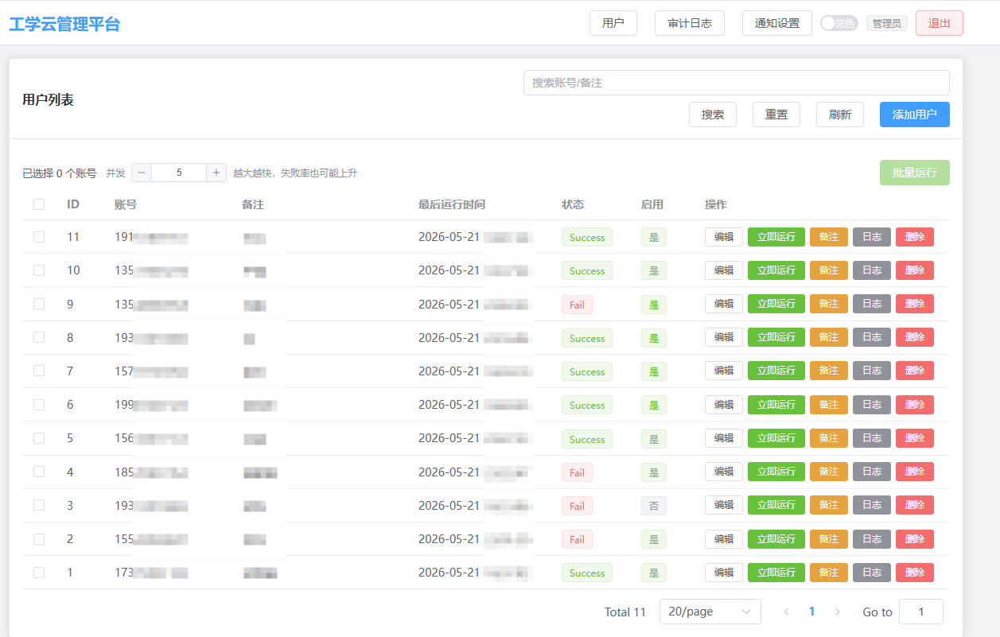
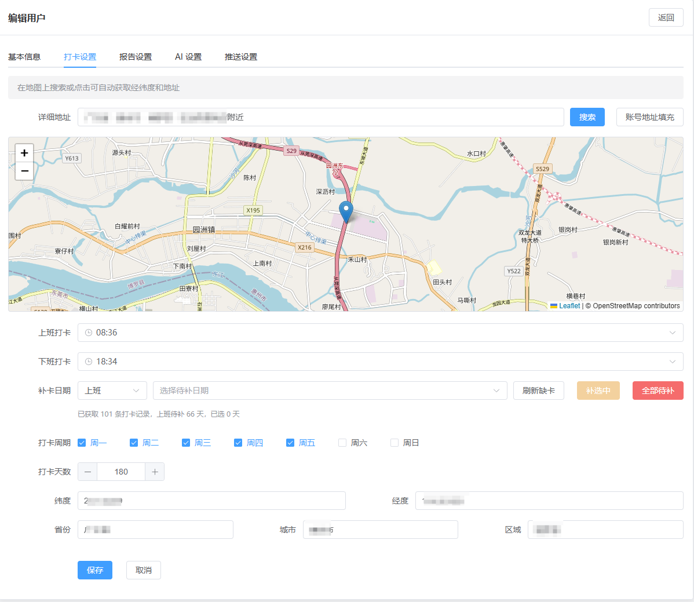
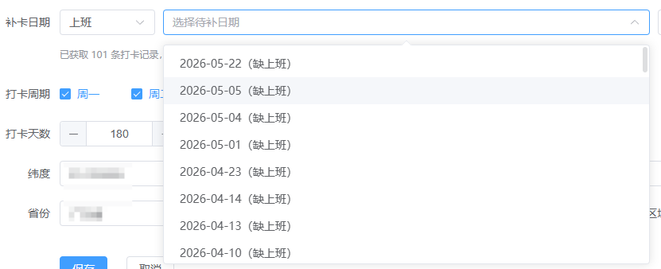
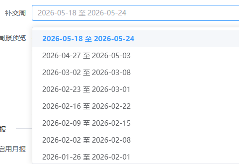
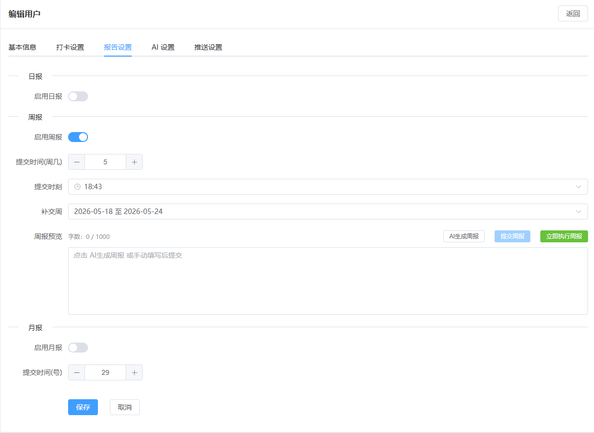
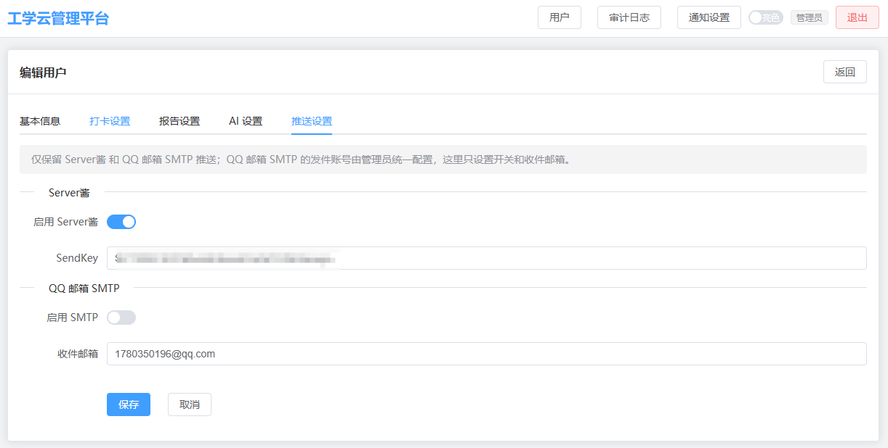
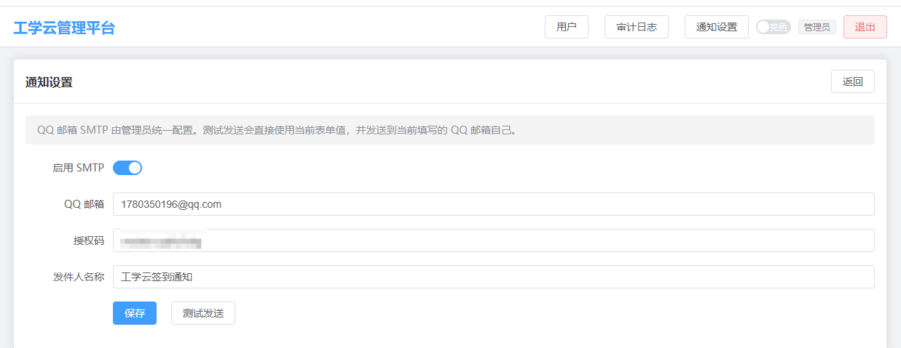

# AutoMoGuDing SaaS 前端

`web/` 是 AutoMoGuDing SaaS 的 Vue 3 前端工程，包含管理端和用户端两套页面。项目使用 Vite 构建，UI 组件基于 Element Plus。

## 前端速览

| 维度 | 内容 |
|------|------|
| 框架 | Vue 3 |
| 构建工具 | Vite |
| 状态管理 | Pinia |
| 路由 | Vue Router |
| UI | Element Plus |
| HTTP | Axios |
| 地图辅助 | 默认内嵌 `https://www.mapchaxun.cn/jingweidu` 作为经纬度核对页 |

## 页面结构

### 管理端

| 路径 | 页面 | 说明 |
|------|------|------|
| `/login` | 后台登录页 | 管理员入口 |
| `/` | 会话分流入口 | 管理员进入用户列表，用户进入 `/u`，未登录进入 `/u/login` |
| `/create` | 新增用户页 | 创建用户与基础配置 |
| `/edit/:id` | 用户编辑页 | 打卡、补卡、报告、单用户推送 |
| `/users/:id/preauthorizations` | 用户预授权页 | 需要 `tasks:run`，按日期代用户完成预授权 |
| `/audit` | 审计日志页 | 关键操作记录 |
| `/settings` | 系统设置页 | AI、SMTP、工学云补卡代理 |
| `/settings/notifications` | 通知设置页 | 全局邮箱通知 |

### 用户端

| 路径 | 页面 | 说明 |
|------|------|------|
| `/u/login` | 用户登录页 | 独立用户端认证状态 |
| `/u/register` | 用户注册页 | 受后端注册开关控制 |
| `/u` | 用户工作台 | 手动执行、执行记录、日报快捷入口 |
| `/u/settings` | 我的配置 | 打卡、报告、补卡、个人推送 |
| `/u/preauthorizations` | 打卡预授权 | 今天及未来上 / 下班授权、过去日期补卡授权 |

用户端和管理端登录态不混用。管理端使用 `src/stores/auth.js`，用户端使用 `src/stores/userAuth.js`。

## 截图速览

### 管理端

| 用户列表 | 打卡设置 |
|---|---|
|  |  |

| 补卡详情 | 日报 / 周报 / 月报补交 |
|---|---|
|  |  |

| 报告设置 | 推送设置 | 全局邮箱通知 |
|---|---|---|
|  |  |  |

### 用户端

| 用户工作台 | 打卡配置 |
|---|---|
|  |  |

| 报告配置 | 推送配置 |
|---|---|
|  |  |

## 页面说明

### 用户工作台

`/u` 对应 `UserHome.vue`。页面聚焦于日常操作：展示登录账号、绑定状态和最近状态，提供统一执行入口，以及日报的生成与提交快捷区。

### 我的配置

`/u/settings` 对应 `UserSettings.vue`。页面集中放置账号绑定、工学云打卡配置、日报 / 周报 / 月报配置和个人推送设置。

### 管理端用户编辑页

`/edit/:id` 对应 `UserEdit.vue`。管理端可在同一页完成用户的打卡、补卡、报告和推送配置，和用户端页面保持同一套字段口径。

### 打卡预授权页面

用户端 `/u/preauthorizations` 和管理端 `/users/:id/preauthorizations` 复用同一套组件：

| 组件 | 职责 |
|------|------|
| `ClockInPreauthorizationPage.vue` | 根据端类型选择 Axios 实例，管理列表、分页、历史折叠和授权生命周期 |
| `ClockInPreauthorizationList.vue` | 桌面扁平表格、移动紧凑列表、4 种状态和行级操作 |
| `ClockInPreauthorizationDialog.vue` | 校验两种 URL，打开支付宝，并显式确认「我已完成授权」 |
| `views/user/UserPreauthorizations.vue` | 用户端薄包装页 |
| `views/UserPreauthorizations.vue` | 管理端薄包装页，读取路由用户 ID |

页面默认加载今天及未来列表，首次展开「过去日期与补卡」时才请求 `scope=past`。过去日期每天只有 1 项，可用于上班或下班补卡；今天及未来每天有上班、下班两项。桌面和移动端共享相同数据，不会各自维护状态副本。

开始授权响应只保存在组件内存。关闭对话框会立即清空签名票据和 URL；点击「我已完成授权」前不会调用完成接口。两种打开方式如下：

| 方式 | 前端校验 | 打开行为 |
|------|----------|----------|
| 浏览器打开 | 必须以 `https://ds.alipay.com/` 开头 | 使用新窗口和 `noopener,noreferrer` |
| 支付宝打开 | 必须以 `alipays://` 开头 | 交给系统协议处理器 |

列表响应不包含登记编号、签名票据或 URL。前端不把这些值写入 `localStorage`、Pinia、路由参数或通知消息。

### 支付宝安全验证对话框

`src/components/AlipayVerificationDialog.vue` 是没有可用预授权时的即时验证组件。即时登记编号和深链只保存在页面内存，不写入 `localStorage` 或 Pinia；前端只允许打开 `alipays://` 链接。

| 调用端 | 触发响应 | 继续接口 |
|--------|----------|----------|
| 用户端 `UserHome.vue` | `/app/run` 的任务结果包含验证详情 | `POST /app/clock-in/alipay/continue` |
| 管理端 `UserList.vue` | `/users/{id}/run` 的任务结果包含验证详情 | `POST /users/{id}/clock-in/alipay/continue` |

用户点击「验证完成，继续打卡」后只发起 1 次请求。成功时关闭对话框；再次需要验证时替换登记信息；普通失败保留当前状态并显示后端错误。

## 开发命令

| 命令 | 说明 |
|------|------|
| `cd web` | 进入前端目录 |
| `npm ci` | 按 `package-lock.json` 安装依赖，CI 和验证优先使用 |
| `npm run dev` | 启动 Vite，默认监听 `0.0.0.0:5173` |
| `npm audit --audit-level=high` | 检查高危及以上依赖漏洞 |
| `npm run lint` | 运行前端质量门 |
| `npm test` | 运行前端静态回归测试 |
| `npm run build` | 生成生产构建到 `web/dist` |
| `npm run preview` | 预览构建产物 |

### 环境变量

| 环境变量 | 作用 |
|----------|------|
| `VITE_API_PROXY_TARGET` | 覆盖 `/api` 代理目标，默认 `http://127.0.0.1:8147` |
| `VITE_MAP_DISPLAY_URL` | 覆盖管理端打卡设置中内嵌的经纬度核对页 |

示例：

```bash
VITE_API_PROXY_TARGET=http://127.0.0.1:8147 npm run dev
```

## 接口约定

| 主题 | 约定 |
|------|------|
| API 前缀 | 前端统一通过 `/api` 访问后端 |
| 管理端请求 | `src/api/http.js` |
| 用户端请求 | `src/api/userHttp.js` |
| 错误提示 | `src/utils/notify.js` 统一解析并展示 |
| 认证失败 | `401` 清空对应端登录态并跳转对应登录页 |
| Cookie | 后端使用 HttpOnly Cookie；前端不把 token 放进 `localStorage` |
| CSRF | 非安全方法由后端校验 CSRF，前端按 Axios 实例约定携带 |
| 支付宝验证 | 两端复用共享对话框，继续接口按各自认证状态和用户范围调用 |
| 打卡预授权 | 两端复用共享列表和授权对话框；临时票据与 URL 仅保存在组件内存 |

## 目录结构

| 路径 | 说明 |
|------|------|
| `web/src/api/` | 管理端和用户端 Axios 实例 |
| `web/src/components/` | 管理端和用户端共享组件 |
| `web/src/router/` | 路由、认证守卫和入口分流 |
| `web/src/stores/` | 管理端和用户端认证状态 |
| `web/src/utils/` | 消息提示等前端工具 |
| `web/src/views/` | 页面组件 |
| `web/vite.config.js` | Vite 配置和 `/api` 代理 |
| `web/package.json` | 前端依赖和脚本 |

## 联调提示

| 场景 | 说明 |
|------|------|
| 本地开发后端不在默认地址 | 用 `VITE_API_PROXY_TARGET` 指向后端地址 |
| 打卡设置页内嵌地图显示异常 | 检查 `VITE_MAP_DISPLAY_URL` 是否可访问 |
| 用户端登录后被带回登录页 | 检查用户端 cookie、后端会话和 `401` 处理 |
| 管理端和用户端互相串号 | 检查是否同时打开了两套登录态，或浏览器残留旧 cookie |
| 预授权页面返回 403 | 管理端确认当前账号具备 `tasks:run`；用户端确认绑定关系有效 |
| 浏览器或支付宝按钮禁用 | 检查开始授权响应 URL 的协议和域名，不在前端绕过校验 |
